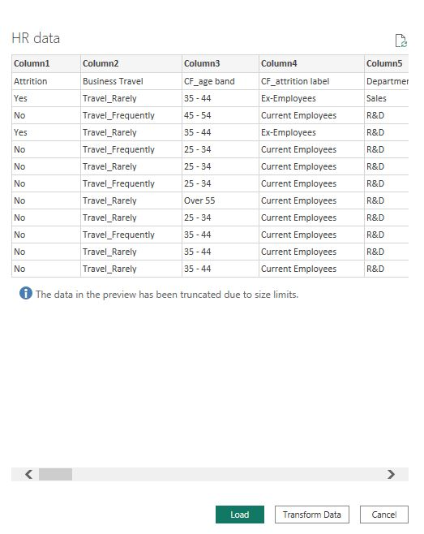
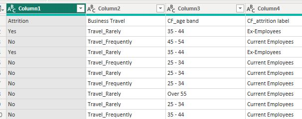
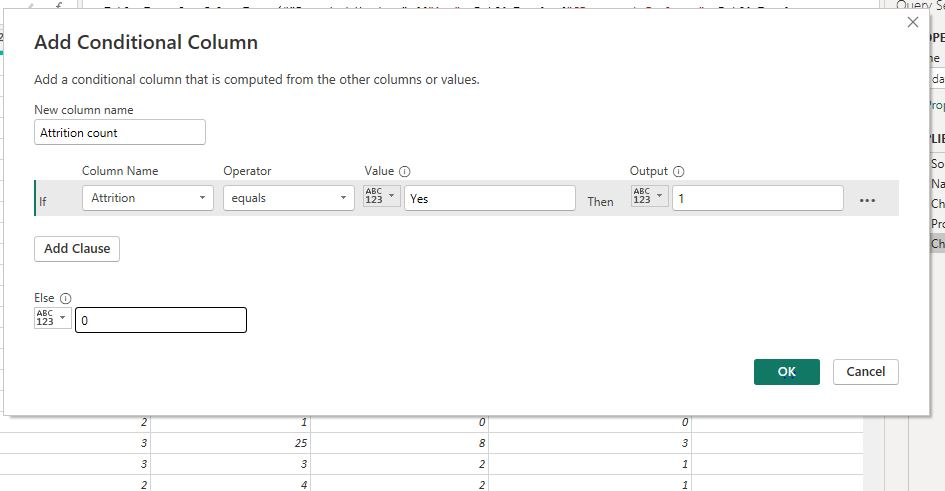
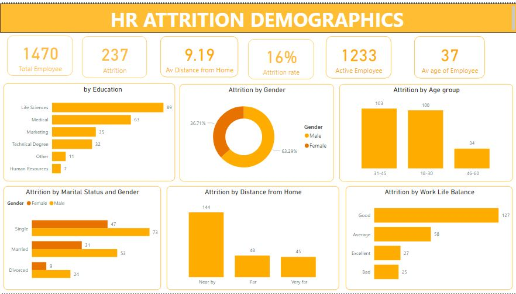
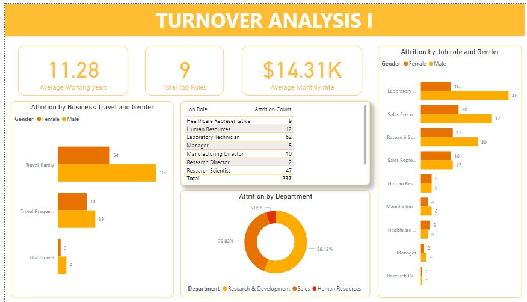
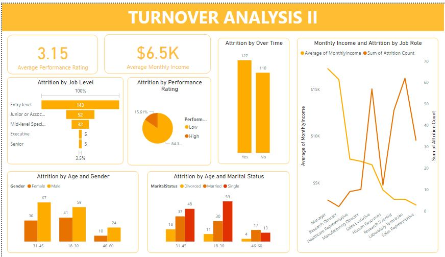
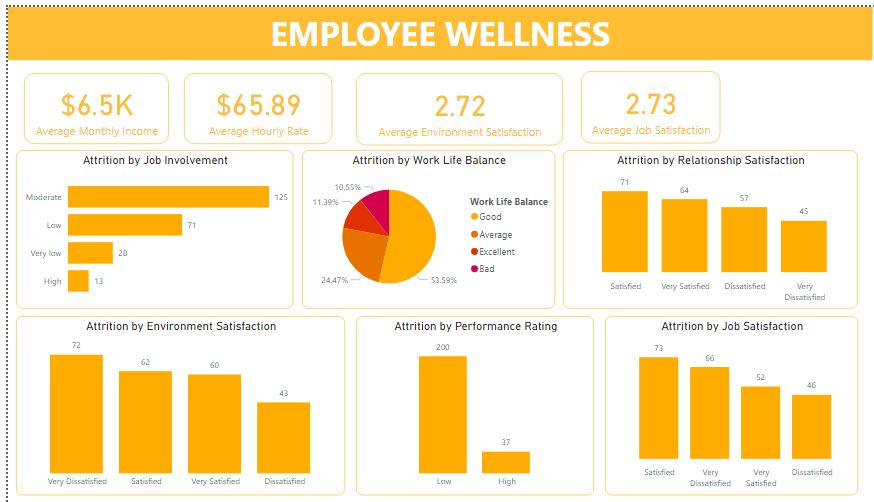

# HR ATTRITION PROJECT

---
## **Project Outline**
- [Project Overview](#Project-Overview)
- [Dataset](#Dataset)
- [Tools Used for Analysis](#Tools-Used-for-Analysis)
- [Data Cleaning and Transformation](#Data-Cleaning-and-Transformation)
- [Results and Findings](#Results-and-Findings)
- [Recommendation](#Recommendation)
---

## Project Overview
The purpose of this project is to perform data analysis on the HR ATTRITION dataset based on the indicators that mostly affect the employment status of employees in a company.

This project report focuses on four important insights which are
1. Demographic insights reflects the summary of the employee statistics which includes the age group, 
gender, marital status, etc.

2. Turnover Analysis I provides insights on employee attrition which includes departure by department, job role, working years, business travel, etc

3. Turnover Analysis II provides insights on monthly income, overtime, job level, etc.

4. Employee Wellness provides insights on job involvement, work life balance, performance rating, etc.

---
## Dataset
The dataset used can be downloaded 
[here](https://drive.google.com/file/d/1sBnniRB8LApHtMCEED0_rf3mLA0Abrtf/view?usp=drivesdk)

---

## Tools Used for Analysis 
The tool used for this project analysis is Power BI and it can be found [here](https://powerbi.microsoft.com/en-us/downloads/)

---

## Data Cleaning and Transformation
The following data cleaning and transformation processes perform on the dataset:

I loaded the HR ATTRITION datasets into Power BI for cleaning and transformation.

After which I made the first row of the dataset as the header.

I also checked for duplicate and missing values. 
The data types for some the variable names starting from the Age, distance from home, employee count, etc were also changed to whole number.

I added a conditional column by taking the dataset to the power query editor to calculate the attrition count and then changed the data type to whole number.

I used the DAX functions to calculate the Current Employee and Attrition rate.

I used data groups on the following variables to aggregate certain values together for meaningful insights:
1. Age group - Ages 18, 19, 20 to 30 are grouped as '18-30', ages 31, 32 to 45 are grouped as '31-45' and ages 46 to 60 are grouped as '46-60'.
2. Distance from Home - 1-10 is considered as 'Near', 10-20 is considered as 'Far' and 20-30 is considered as 'Very far'.
3. Work Life Balance - Value 1 is considered as 'Bad', value 2 is considered as 'Average', value 3 as 
'Good' and value 4 is considered as 'Excellent'.
4. Performance Rating - The values with 3 is grouped as 'Low' while the values with 4 is grouped as 'High'
5. Job Levels - values 1 is considered as 'Entry level', value 2 is considered as 'Junior or Associate Level', value 3 is considered as 'Mid level Specialist', value 4 is considered as 'Senior' and value 5 is considered as 'Executive'.
6. Environmental, Job and Relationship Satisfaction -  Rated on a scale ranging from 1 to 4 in which value 1 represents 'Very dissatisfied, value 2 represents 'dissatisfied', value 3 represent 'Satisfied' and value 4 represents 'Very satisfied'.
7. Job Involvement is also grouped as 'Very low', 'Low', 'Moderate' and 'High' on a scale of 1-4.

---

## Results and Findings

## DEMOGRAPHICS

The following insights are gotten from the demographics report:
1. The total number of Employees in the dataset is 1470
2. The total number of Current or Active Employees in the company is 1233
3. The average age of Employees is 37yrs.
4. Attrition count: The total number of Employee that have left the company is 237.
5. Gender: The male employees have the highest attrition rate of about 63.29% compared to the female employees.
6. Age group: The number of employees that fall under the age group 31-45 have the highest attrition rate which accounted for about 103 in total.
7. Education level: The employees that studied life sciences have the highest attrition rate of 89  followed by medicals (63) and so on.
8. Marital status: The single employees have the highest number of attrition of about 120 followed by the married employees of about 84 while the divorced employees have the least number of attrition.

## TURNOVER ANALYSIS I

The following insights are gotten from the turnover analysis I report:
1. The average monthly rate of employees is 14,31k
2. The average working years is 11.28yrs
3. The total number of job roles of employees is 9
4. Attrition by Business Travel and Gender: The attrition rate is higher for both male (102) and female (24) employees that rarely travel than the employee that frequently travel.
5. Attrition by Department: The doughnut chart shows that the research & Development department has the highest attrition rate (56.12%) than the sales department and human resources department.
6. Attrition by Job Role and Gender: The attrition rate is highest for male Laboratory Technicians (46) than the female Laboratory Technicians which is followed by the male sales executive (37).

## TURNOVER ANALYSIS II

The following insights are gotten from the turnover analysis II report:
1. The average performance rating is 3.15
2. The average monthly income is 6.50k
3. Attrition by Job Level: Entry level employees have the highest attrition of 143 than the junior or associate level employees (52), mid level specialist (32), and so on.
4. Attrition by Performance Rating: The pue chart shows that employees with low performance rating have the highest attrition of 200 when compared to those with high performance rating (37).
5. Attrition by Over time: The bar chart shows that employees that worked overtime have the most attrition 
(127) while those that do not work over time have less attrition rate (110).
6. Attrition by Age group and Gender: The clustered bar chart shows that the male employees under the age group 31-45yrs have the highest attrition (67) while the female employees under the age group 18-30yrs also have the highest attrition (41).
7. Attrition by Age group and Marital Status: The clustered bar chart shows that the single employees that falls under the age group 18-30yrs have most of the attrition.
8. Monthly Income and Attrition by Job Role: The line graph shows that the higher the average monthly income, the lower the attrition for the Manager and Research Director.

## EMPLOYEE WELLNESS

The following insights are gotten from the employee wellness report:
1. The average hourly rate is 65.89k
2. The average environment satisfaction is 2.72
3. The average job satisfaction is 2.73
4. Attrition by Job Involvement: The barchart shows that employees that are Moderately involved with the job have the highest attrition of 124 followed by employees with low job involvement (71).
5. Attrition by Work Life Balance: The piechart shows that employees with good work life balance have the most attrition rate (53.59%) while employees with bad work life balance have the least attrition rate (10.5%).
6. Attrition by Relationship Satisfaction: The bar chart shows that employees that are satisfied with their relationships have the highest attrition (71) while  employees that are very dissatisfied with their relationships have the lowest attrition (45).
7. Attition by Job Satisfaction: The bar chart shows that employees that are satisfied with their jobs have the most attrition (73) while employees that are dissatisfied with their jobs have the least attrition (46).
8. Attition by Environment Satisfaction: The bar chart shows that employees that are very dissatisfied with their environment have the most attrition (72) while employees that are dissatisfied with their environment have the least attrition (43).
---

## Recommendation

The following are the recommendations made based on the insights derived:

- Work Life Balance: The company should help employees achieve an excellent and healthy balance between their work and personal lives by providing flexible work arrangements and remote work options for their employees.
- Relationship Satisfaction: Open communication should be greatly encouraged for employees to express their thoughts about their colleagues. Also, opportunities for social interaction should be provided to improve the relationships amongst themselves.
- Job Satisfaction: Competitive salaries and other benefits should be provided to the employees in order to them productive and innovative.
- Environment Satisfaction: The company should create a supportive work environment for workers to learn, make mistakes and improve themselves and also give feedbacks on their performances at work.
- Job Involvement: Team work and collaboration should be encouraged among workers as this would keep them fully engaged and invested in their work.
- Performance Rating: Employees' performance can be increased by providing the necessary resources and supports needed for their jobs. Training opportunities should be made available to all for better improvement.
